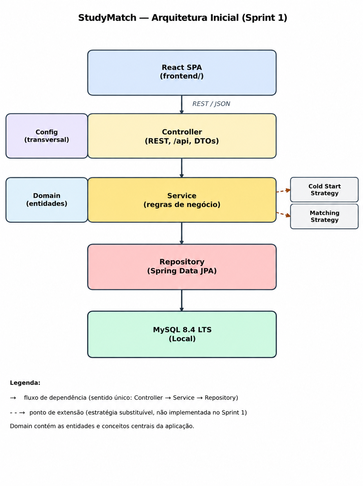
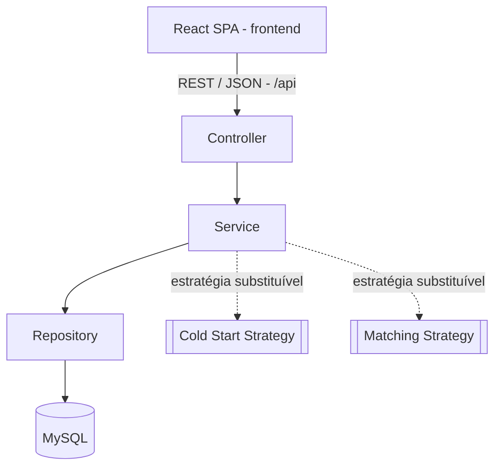

# Arquitetura Inicial — StudyMatch

## Visão Geral

O StudyMatch segue uma arquitetura full-stack em camadas.

O frontend é uma SPA desenvolvida em React que comunica com uma API REST desenvolvida em Spring Boot. O backend encontra-se organizado segundo o fluxo `Controller → Service → Repository`, sendo a persistência assegurada por MySQL através de Spring Data JPA/Hibernate.

Esta arquitetura procura garantir uma separação clara de responsabilidades e permitir que decisões ainda em aberto, como as estratégias de *cold start* e *matching*, possam evoluir sem exigir alterações profundas no restante sistema.





## Componentes e Responsabilidades

### Frontend

O frontend é uma SPA desenvolvida com React e Vite.

É responsável por:

- apresentar a interface ao utilizador;
- recolher dados introduzidos pelo utilizador;
- comunicar com o backend através da API REST;
- apresentar estados de carregamento, sucesso e erro.

O frontend não deve conter regras de negócio do domínio.

### Controller

A camada `Controller` constitui a entrada da API REST.

É responsável por:

- receber pedidos HTTP;
- validar o formato dos dados recebidos;
- converter pedidos e respostas através de DTOs;
- delegar a execução das operações para a camada `Service`.

Um Controller nunca deve aceder diretamente a um Repository.

### Service

A camada `Service` contém a lógica de aplicação e coordena as operações do sistema.

É responsável por:

- executar casos de uso;
- aplicar e coordenar regras de negócio;
- interagir com os objetos de domínio;
- utilizar os Repositories para acesso a dados;
- integrar estratégias substituíveis, como *cold start* e *matching*.

As regras de negócio devem permanecer nesta camada e nos objetos de domínio, evitando lógica de negócio nos Controllers.

### Repository

A camada `Repository` é responsável pelo acesso aos dados.

Utiliza Spring Data JPA para comunicar com a base de dados e não deve conter regras de negócio.

### Domain

O pacote `domain` contém as entidades e conceitos centrais do domínio do StudyMatch, como estudantes, unidades curriculares, trajetórias académicas, competências e outros conceitos que sejam identificados ao longo do projeto.

Os objetos de domínio representam informação e comportamentos relevantes para as regras de negócio da aplicação.

### DTO

Os DTOs (*Data Transfer Objects*) representam os dados trocados entre a API e o exterior.

A utilização de DTOs evita expor diretamente as entidades internas através da API REST.

### Config

O pacote `config` contém configurações transversais da aplicação, como configuração de CORS e Beans do Spring.

## Regras de Dependência

O fluxo principal de dependências do backend é:

```text
Controller → Service → Repository
                   ↓
                 Domain
```

Devem ser respeitadas as seguintes regras:

- `Controller` pode utilizar `Service` e DTOs;
- `Controller` não pode aceder diretamente a `Repository`;
- `Service` pode utilizar `Repository` e objetos de `Domain`;
- `Repository` é responsável apenas pelo acesso e persistência de dados;
- regras de negócio não devem ser implementadas nos Controllers;
- o frontend apenas comunica com o backend através da API REST.

## Comunicação Frontend ↔ Backend

A comunicação entre frontend e backend é realizada através de uma API REST utilizando JSON.

Todos os endpoints da aplicação devem utilizar o prefixo:

```text
/api
```

Por exemplo:

```text
GET /api/students
GET /api/status
```

Em desenvolvimento, o Vite pode utilizar um proxy de `/api` para:

```text
http://localhost:8080
```

Alternativamente, o backend poderá configurar CORS no pacote `config`.

As respostas de erro devem seguir um formato JSON consistente, por exemplo:

```json
{
  "error": "Estudante não encontrado",
  "status": 404
}
```

## Persistência

A persistência é realizada utilizando:

- MySQL 8.4 LTS como sistema de gestão de base de dados;
- Spring Data JPA para acesso aos dados;
- Hibernate como implementação ORM;
- Flyway para controlo e versionamento das alterações ao esquema da base de dados.

As migrações Flyway devem ser colocadas em:

```text
backend/src/main/resources/db/migration/
```

Durante o desenvolvimento e os testes de persistência será utilizada uma instância local de MySQL 8.4 LTS, conforme definido na stack tecnológica do projeto.

## Pontos de Extensão

Existem decisões funcionais que permanecem deliberadamente abertas nesta fase do projeto.

### Cold Start Strategy

O sistema deverá permitir uma estratégia substituível para representar ou tratar estudantes com pouco ou nenhum histórico académico.

A estratégia concreta será definida numa fase posterior do projeto.

### Matching Strategy

O mecanismo responsável pela formação de grupos deverá também ser substituível.

A arquitetura deve permitir alterar ou evoluir o algoritmo de matching sem modificar os Controllers ou a camada de persistência.

Estas estratégias serão utilizadas através da camada `Service`, mantendo o restante sistema desacoplado das implementações concretas.

## Relação com Outras Decisões

Esta arquitetura serve de base para a estrutura do projeto definida posteriormente em `docs/project-structure.md` na Issue #25.

A decisão arquitetural encontra-se registada em:

```text
docs/decisions/ADR-002-arquitetura.md
```